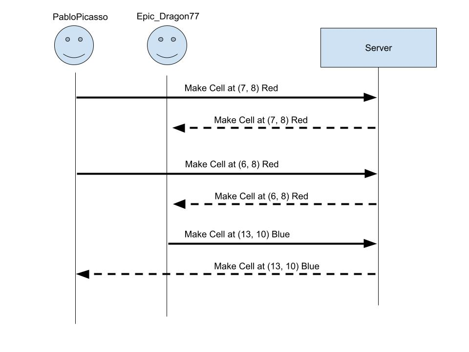

# startup
CS 260 Startup Project

## Specification Deliverable

### Elevator Pitch

Drawing is fun! Drawing alone is less fun. Connect with the world in Retro Renditions: An online grid-based art board where everywhere can contribute their ideas to one global work of art! Save the board at any time to capture your masterpiece, and see who's editing with you to join together in fun. Feel free to draw a tic tac toe board or anything else to play games with others too! The options are limitless with Retro Renditions.

### Design

Here's a sequence diagram showing how to people can interact with the backend to draw.

### Key Features

- Secure login over HTTPS
- Ability to choose what color you're using
- Ability to change the color of a square in the global grid
- Display the grid, including everyone's changes in realtime
- Ability to save the board as an image
- Shows people joining and changing the board in realtime
- Simple chat functionality
- Global board is stored persistantly
