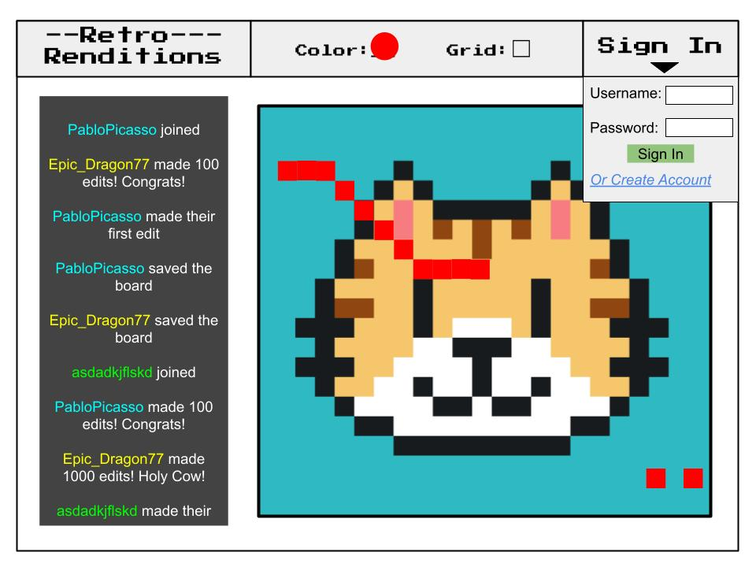

# startup
CS 260 Startup Project

## Specification Deliverable

### Elevator Pitch

Drawing is fun! Drawing alone is less fun. Connect with the world in Retro Renditions: An online grid-based art board where everywhere can contribute their ideas to one global work of art! Save the board at any time to capture your masterpiece, and see who's editing with you to join together in fun. Feel free to draw a tic tac toe board or anything else to play games with others too! The options are limitless with Retro Renditions.

### Design

Here's a sequence diagram showing how to people can interact with the backend to draw.

### Key Features

- Secure login over HTTPS
- Ability to choose what color you're using
- Ability to change the color of a square in the global grid
- Display the grid, including everyone's changes in realtime
- Ability to save the board as an image
- Shows people joining and changing the board in realtime
- Simple chat functionality
- Global board is stored persistantly

### Technologies

I am going to use the required technologies in the following ways.

- **HTML** - Uses proper HTML structure for all webpages. Three pages: homepage with info, account creation page, and main drawing page. Hyperlinks between pages.
- **CSS** - Styling webpages consitently throughout to match the retro style of the created images. Good spacing and a neutral color pallete. Styling works on different device types and sizes.
- **JavaScript** - Provides login, drawing board display, drawing board changes, color choice, backend endpoint calls.
- **Service** - Backend service with endpoints for:
  - login
  - retrieving global board
  - submitting changes to board
- **DB/Login** - Store users, and the global board in database. Create new users and login existing users. Securely store credentials in database. Can't draw without being authenticated.
- **WebSocket** - Push out simple broadcast such as joining, reaching coloring milestones, and simple chat.
- **React** - Application ported to use the React web framework.
  
  
### HTML deliverable  
  
For this deliverable I built out the structure of my application using HTML.  
  
- **HTML pages** - Three TML pages: One main one with the message log and main art board, one for creating an account and one with information on the project.  
- **Links** - The login bar on all pages, and the create account button, automatically link to the main art board. The login bar also has an optional link to the create an account page. The logo in the top left of all pages links to the main art board. Additionally the footer links to my github and the about page.  
- **Text** - The about page has text describing the project. The input forms for login, account creation, and the footer all use text as well. The message log utilizes text to display messages.  
- **Images** - The site uses an image for a favicon, and as the logo in the top left of all pages.  
- **DB/Login** - Input box and submit button for login. The art board represents data pulled from the database.  
- **WebSocket** - The message log results represents the messages sent out from realtime interaction with the board.
  
  
### CSS deliverable

For this deliverable I properly styled the application into its final appearance.

- **Header, footer, and main content body** - I used bootstrap to create a navbar and dropdown menu in the header, and flexboxes to center all my content and arrange everything how I wanted in the main body.
- **Navigation elements** - I made all links blue and buttons green to highlight their functionality, and applies fonts to links in the footer to match the rest of it.
- **Responsive to window resizing** - My app looks great on all window sizes and devices, responsive design from flexboxes and bootstrap
- **Application elements** - Centered on page with matching colors and partially transparent backgrounds to flow better with the simple background.
- **Application text content** - Consistent two fonts - One "fun" font for most text and a simpler one for smaller important text like the login information.
- **Application images** - Application logo placed in the header to the side as a link to the home page, added an image of myself in the About section with rounded corners to make it a circle. Both images have a subtle drop-shadow to add depth.  
  
  
### Javascript deliverable  
  
For this deliverable I implemented by JavaScript so that the application works for a single user. I also added placeholders for future technology.

- **login** - When you press login button it takes you to the main drawing page and displays the username, allowing you to draw.
- **database** - Displays the drawing board. Currently this is stored and retrieved from local storage, but it will be replaced with the database data later.
- **WebSocket** - I used the setInterval function to occasionally generate randomly messages from fake users. This will be replaced with WebSocket messages later.
- **application logic** - The drawing board works by an entirely JS powered canvas that draws the board based on the data and detects when the user is drawing on the board.
  
  
### Service deliverable

For this deliverable I added backend endpoints that receives updates to the board and returns the current board.

- **Node.js/Express HTTP service** - Done!
- **Static middleware for frontend** - Done!
- **Calls to third party endpoints** - Calls a [colored noise API]([url](https://php-noise.com/)) to create random backgrounds.
- **Backend service endpoints** - Endpoints for receiving updates to the board and processing them, as well as returning the current board.
- **Frontend calls service endpoints** - I called the above endpoints using the fetch function.
  
  
### DB/Login deliverable
  
For this deliverable I allow users to create accounts and login, and I stored the Board in the database.
  
- **MongoDB Atlas database created** - done!
- **Stores data in MongoDB** - done!
- **User registration** - Creates a new account in the database.
- **existing user** - Does not allow an account to be created if the user already exists.
- **Use MongoDB to store credentials** - Stores both users and the board.
- **Restricts functionality** - You cannot edit the board until you have logged in. This is checked on the backend.
  
  
### WebSocket deliverable
  
For this deliverable I used webSocket to update the votes on the frontend in realtime.
  
- **Backend listens for WebSocket connection** - done!
- **Frontend makes WebSocket connection** - done!
- **Data sent over WebSocket connection** - Both log messages of joining/making x amount of edits/etc are sent.
- **WebSocket data displayed** - All log messages are displayed in realtime. The board fetches the current board in realtime when an edit is made.
- **Celebrated with Cheese** - done!  
  
  
## React deliverable  
  
For this deliverable I converted the application over to use React and vite.

- **Bundled and transpiled** - done using vite!  
- **Components** - The header, footer, main page, about page, joining page, and board are all components.  
- **Router** - Routing between main, joining, and about components.  
- **Hooks** - Track changes in board, color, etc, and login state.  
